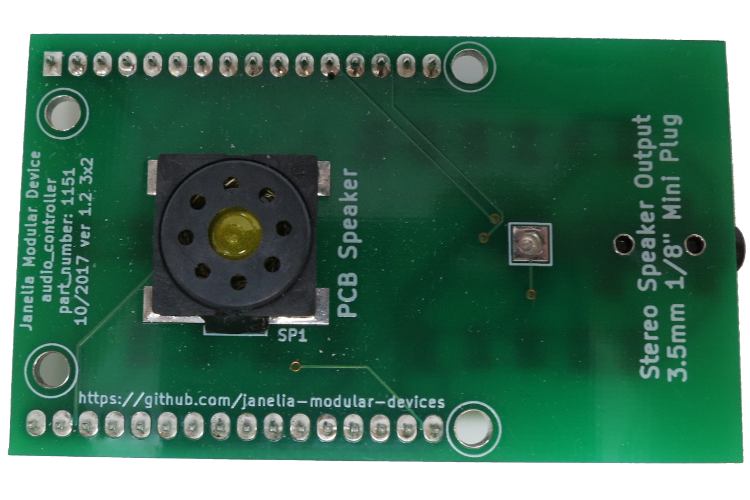
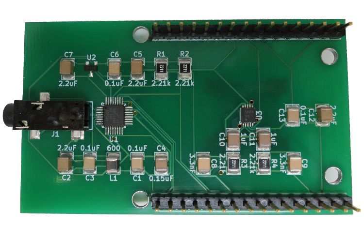
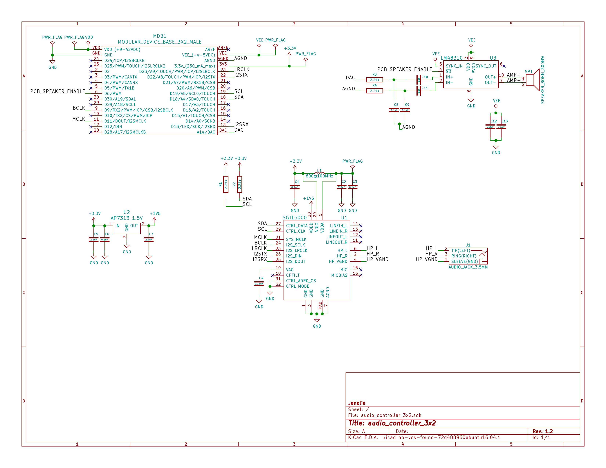
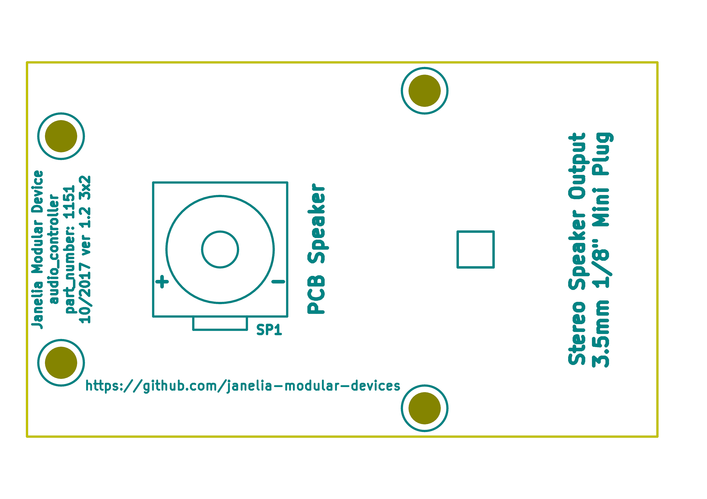
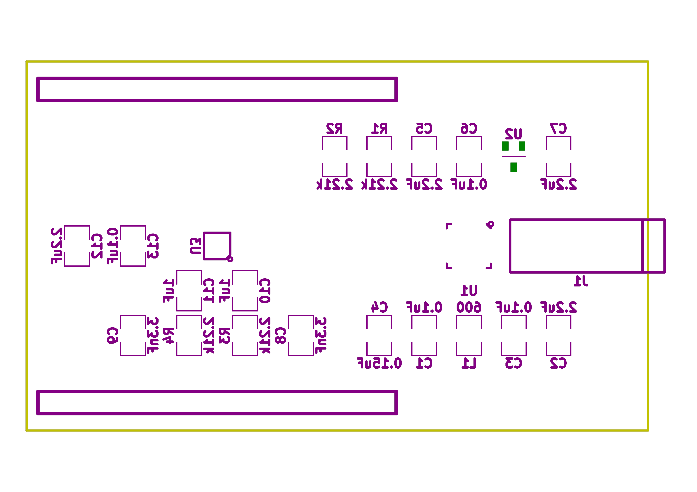

- [Repository Information](#orgaf0de10)
  - [Description](#org4f757df)
- [Images](#org2f2734c)
- [Schematic](#org883ee39)
- [Gerbers](#org9caf1d8)
- [Bill of Materials](#org3ae238b)
  - [PCB Parts](#org8b46f87)
  - [Supplemental Parts](#orgfcb51ff)
  - [Vendor Parts Lists](#org931e373)
- [Supplemental Documentation](#orga858066)
  - [Assembly Instructions](#orgc4d95c2)

# Repository Information

-   **Name:** audio\_controller\_3x2
-   **Version:** 1.2
-   **License:** Open-Source Hardware
-   **URL:** <https://github.com/janelia-kicad/audio_controller_3x2>
-   **Author:** Peter Polidoro
-   **Email:** peter@polidoro.io

## Description

This board plays audio through a pcb mounted speaker and/or external stereo speakers.

# Images

# Schematic

[./schematic/audio\_controller\_3x2.pdf](./schematic/audio_controller_3x2.pdf)

# Gerbers

Send gerbers zip file to your favorite PCB manufacturer for fabrication.

[./gerbers/audio\_controller\_3x2\_v1.2.zip](./gerbers/audio_controller_3x2_v1.2.zip)

# Bill of Materials

## PCB Parts

| Item | Reference(s) | Quantity | PartNumber            | Vendor  | Description                                                             |
|---- |------------ |-------- |--------------------- |------- |----------------------------------------------------------------------- |
| 1    | C1 C13 C3 C6 | 4        | 399-13229-1-ND        | digikey | CAP CER 0.1UF 100V X7R 1210                                             |
| 2    | C10 C11      | 2        | 399-8219-1-ND         | digikey | CAP CER 1UF 100V X7R 1210                                               |
| 3    | C12 C2 C5 C7 | 4        | 478-3591-1-ND         | digikey | 2.2uF 50V Ceramic Capacitor X7R 1210                                    |
| 4    | C4           | 1        | 399-15599-1-ND        | digikey | 0.15uF 100V Ceramic Capacitor X7R 1210                                  |
| 5    | C8 C9        | 2        | 478-5964-1-ND         | digikey | CAP CER 3300PF 2KV X7R 1210                                             |
| 6    | J1           | 1        | CP-3523SJCT-ND        | digikey | 3.50mm Headphone Phone Jack Stereo Connector Solder                     |
| 7    | L1           | 1        | 587-1755-1-ND         | digikey | FERRITE BEAD 600 OHM 1210 1LN                                           |
| 8    | MDB1         | 2        | S1011E-16-ND          | digikey | 16 Position Header Through Hole Male Pins                               |
| 9    | R1 R2 R3 R4  | 4        | P2.21KAACT-ND         | digikey | RES SMD 2.21K OHM 1% 1/2W 1210                                          |
| 10   | SP1          | 1        | 102-3539-1-ND         | digikey | SPEAKER 8OHM 300MW TOP PORT 87DB                                        |
| 11   | U1           | 1        | SGTL5000XNAA3R2CT-ND  | digikey | Stereo Audio Interface 32-QFN                                           |
| 12   | U2           | 1        | AP7313-15SAG-7DICT-ND | digikey | Linear Voltage Regulator IC Positive Fixed 1 Output 1.5V 150mA SOT-23-3 |
| 13   | U3           | 1        | LM48310SD/NOPBCT-ND   | digikey | IC AMP AUDIO PWR 2.6W MONO 10SON                                        |

## Supplemental Parts

| Item | Quantity | PartNumber      | Vendor | Description               |
|---- |-------- |--------------- |------ |------------------------- |
| 1    | 1        | N82E16836121042 | newegg | Logitech Z130 5W Speakers |

## Vendor Parts Lists

[./bom/digikey\_parts.csv](./bom/digikey_parts.csv)

[./bom/supplemental\_newegg\_parts.csv](./bom/supplemental_newegg_parts.csv)

# Supplemental Documentation

## Assembly Instructions

-   Solder surface mount and through hole components onto the pcb.
